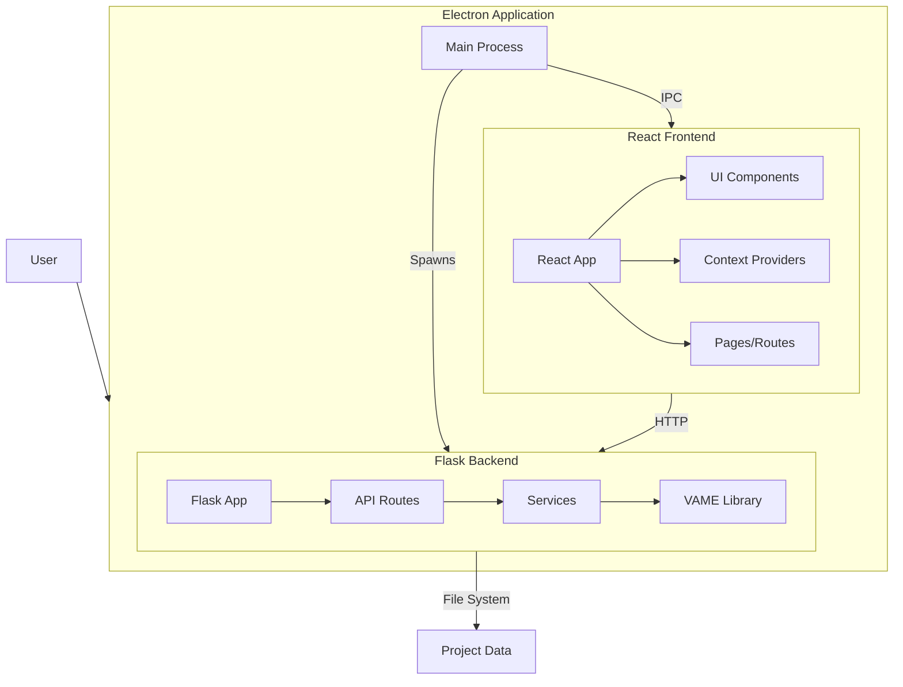

# VAME Desktop System Patterns

## System Architecture

VAME Desktop follows a hybrid architecture that combines Electron for the desktop application framework, React for the frontend UI, and a Python Flask backend for interfacing with the VAME library. This architecture enables a user-friendly interface while leveraging the powerful machine learning capabilities of the VAME Python library.

## Key Technical Decisions

### 1. Electron as Application Framework

- **Decision**: Use Electron to create a cross-platform desktop application.
- **Rationale**: Enables development of a single codebase that runs on Windows, macOS, and Linux, while providing native-like capabilities.
- **Implementation**: The Electron main process manages the application lifecycle, window creation, and spawns the Python backend.

### 2. Python Backend via Child Process

- **Decision**: Run the Python Flask backend as a child process of the Electron app.
- **Rationale**: Allows direct integration with the VAME Python library while maintaining separation of concerns.
- **Implementation**: The main process spawns the Python backend (either directly in dev mode or via PyInstaller-bundled executable in production) and waits for it to be ready before creating the main window.

### 3. REST API for Backend Communication

- **Decision**: Use a REST API for communication between the frontend and backend.
- **Rationale**: Provides a clean separation of concerns and allows for potential future decoupling if needed.
- **Implementation**: Flask with flask-restx exposes endpoints for health checks, file operations, project management, and VAME pipeline execution.

### 4. Context API for State Management

- **Decision**: Use React Context API for state management.
- **Rationale**: Provides a centralized way to manage application state without excessive prop drilling.
- **Implementation**: ProjectsProvider and SettingsProvider contexts manage project data and application settings.

### 5. JSON Schema for Configuration

- **Decision**: Use JSON Schema to define and validate configuration parameters.
- **Rationale**: Enables dynamic form generation and validation with a single source of truth.
- **Implementation**: Schema files in `src/schema/` define the structure and validation rules for various configuration forms.

## Design Patterns

### 1. Model-View-Controller (MVC)

- **Model**: Backend services and VAME library handle data and business logic.
- **View**: React components render the UI.
- **Controller**: API routes and context providers mediate between the model and view.

### 2. Provider Pattern

- Used for state management via React Context.
- ProjectsProvider and SettingsProvider encapsulate state and provide access to components.

### 3. Factory Pattern

- `create_app()` function in the Flask backend creates and configures the application.
- Context creation utilities in the frontend.

### 4. Singleton Pattern

- Single instance of the Electron app enforced via `requestSingleInstanceLock()`.
- Single Python backend process.

### 5. Observer Pattern

- Event listeners for backend status (connected, VAME ready, project ready).
- React state updates trigger re-renders of affected components.

## Component Relationships

### Electron Main Process

- **Responsibilities**:
  - Application lifecycle management
  - Window creation and management
  - Spawning and monitoring the Python backend
  - IPC handler registration

- **Relationships**:
  - Spawns the Python backend as a child process
  - Creates and manages the renderer process (browser window)
  - Communicates with the renderer via IPC

### Python Flask Backend

- **Responsibilities**:
  - Expose REST API for VAME operations
  - Execute VAME pipeline steps
  - Manage project files and configurations
  - Serve static files (images, videos)

- **Relationships**:
  - Wraps the VAME Python library
  - Interacts with the filesystem for project data
  - Communicates with the frontend via HTTP

### React Frontend

- **Responsibilities**:
  - Render the user interface
  - Handle user interactions
  - Manage application state
  - Communicate with the backend

- **Relationships**:
  - Organized into pages, components, and context providers
  - Uses the preload script's exposed APIs to communicate with the main process
  - Makes HTTP requests to the backend API

### Preload Script

- **Responsibilities**:
  - Securely expose APIs to the renderer
  - Bridge between renderer and main process

- **Relationships**:
  - Exposes Electron APIs and custom services to the renderer
  - Communicates with the main process via IPC

## Data Flow

1. User interacts with the React UI.
2. React components update state via context providers.
3. Context providers make HTTP requests to the Flask backend.
4. Flask routes call appropriate services.
5. Services execute VAME library functions.
6. Results are saved to the filesystem and returned to the frontend.
7. Frontend updates UI to reflect new state and display results.

## Error Handling

- Backend errors are caught and returned as HTTP error responses.
- Frontend displays error messages to the user.
- Logs are saved for debugging purposes.
- The application prevents users from performing invalid operations.
